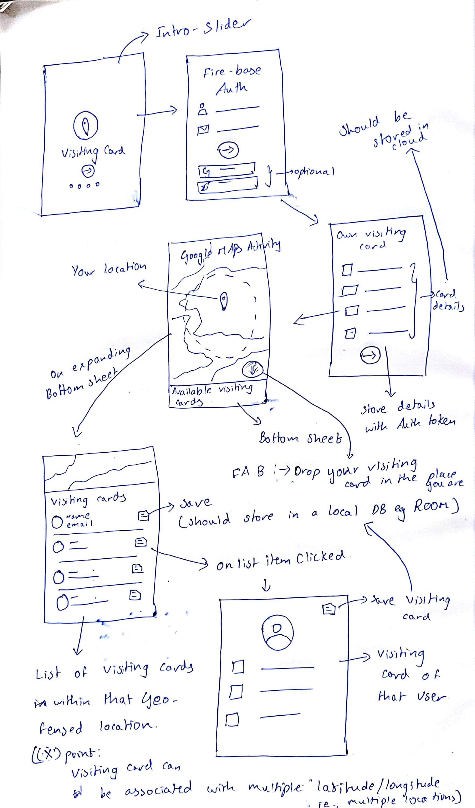

# Visiting Card Android

     

## Quick Insight
An Android application that helps to virtually exchange digital visiting cards while attending meetups and conferences. 

## Work-Flow
- A Splash Screen that Displays the app icon everytime that app is launched. 
- A Quick Walkthrough (Slider) of the Visiting Card Android App when the App is launched for the first time. 
- A Login Activity to ensure only Authentic Users use the app - Implemented using Firebase Authentication. 
- A Visiting Card Activity that lets the Currently Authenticated User to create his/her own visiting card by entering their own Information. 
- A Google Maps activity that helps you spot your current location and also helps you drop your own visiting card at the current location. 
- A Bottom Sheet in the same Maps Activity that gives you all of the dropped Visiting cards within a 500m to 1km radius. 
- Clicking on a particular Visiting Card reveals all the Information present in that card.
- One can also save the Card to their very own Contacts App. 

## Road-Map

    

## How to Contribute
- Look for the `TODO`s in the Project. 
- Claim the Issues by commenting on them.

